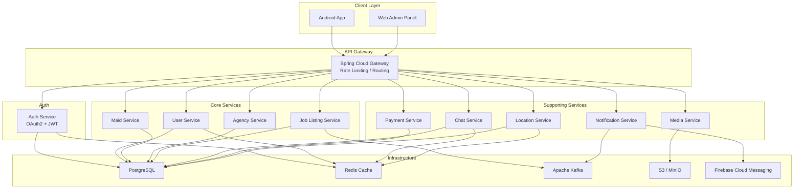

# Housemaid Android Upgrade & Backend Microservices Plan

## Project Audit Summary

The project is a **Housemaid hiring platform** (3 user types: Maid, User/Employer, Agency) built circa 2018-2019 with severely outdated tooling:

| Component | Current | Target |
|---|---|---|
| Gradle Wrapper | 4.10.1 | 8.9 |
| AGP | 3.3.2 | 8.7.3 |
| compileSdk / targetSdk | 28 | 35 |
| Support Library | 28.0.0 | **AndroidX** |
| Crashlytics | Fabric SDK (shutdown) | Firebase Crashlytics |
| FirebaseInstanceIdService | Deprecated | `onNewToken()` in MessagingService |
| Firebase BOM | Individual libs | BOM 33.x |
| Retrofit | 2.4.0 | 2.11.0 |
| OkHttp | 3.11.0 | 4.12.0 |
| Glide | 4.9.0 | 4.16.0 |
| Picasso | 2.71828 | **Remove** (use Glide only) |
| google-services plugin | 4.2.0 | 4.4.2 |
| Java source | 1.8 | 17 |

> [!CAUTION]
> **Hardcoded secrets found** — keystore password in `app/build.gradle` (line 22-24), Fabric API key in `AndroidManifest.xml` (line 362-363), and API keys in `google-services.json`. These should be moved to environment variables or `local.properties`.

> [!WARNING]
> **Hardcoded API base URL** — `http://13.58.98.218/Maid/api/` in `ApiClient.java` uses HTTP (not HTTPS) and a raw IP. This must be updated when the new backend is ready.

---

## Phase 1: Android Project Upgrade

### Step 1 — Gradle & AGP Upgrade

#### [MODIFY] [gradle-wrapper.properties](file:///e:/projects/android-projects/housemaid-android-master/gradle/wrapper/gradle-wrapper.properties)
- Update `distributionUrl` to Gradle **8.9**

#### [MODIFY] [build.gradle (root)](file:///e:/projects/android-projects/housemaid-android-master/build.gradle)
- AGP `3.3.2` → `8.7.3`
- google-services `4.2.0` → `4.4.2`
- **Remove** Fabric classpath (`io.fabric.tools:gradle`)
- **Remove** `maven.fabric.io` repository
- Replace `jcenter()` with `mavenCentral()`
- Add Firebase Crashlytics plugin `com.google.firebase.crashlytics:3.0.3`

#### [MODIFY] [settings.gradle](file:///e:/projects/android-projects/housemaid-android-master/settings.gradle)
- Convert to modern `pluginManagement` + `dependencyResolutionManagement` format

#### [MODIFY] [gradle.properties](file:///e:/projects/android-projects/housemaid-android-master/gradle.properties)
- Add `android.useAndroidX=true`
- Add `android.enableJetifier=true`
- Add `android.nonTransitiveRClass=true`
- Bump JVM args: `-Xmx2048m`

---

### Step 2 — Support Library → AndroidX Migration

#### [MODIFY] [app/build.gradle](file:///e:/projects/android-projects/housemaid-android-master/app/build.gradle)
- `compileSdkVersion 28` → `compileSdk 35`
- `targetSdkVersion 28` → `targetSdk 35`
- `minSdkVersion 21` → `minSdk 21`
- Remove Fabric buildscript block and `apply plugin: 'io.fabric'`
- Remove duplicate `apply plugin: 'com.google.gms.google-services'` (line 128)
- Replace `buildToolsVersion` (auto-resolved by AGP 8+)
- Fix `lintOptions` → `lint` block
- Fix `dataBinding { enabled = true }` → `buildFeatures { dataBinding true }`
- Fix hardcoded JNI path
- Fix signing config to use `rootProject.file()`

**Dependency replacements:**

| Old | New |
|---|---|
| `com.android.support:support-v4:28.0.0` | `androidx.core:core:1.13.1` |
| `com.android.support:appcompat-v7:28.0.0` | `androidx.appcompat:appcompat:1.7.0` |
| `com.android.support.constraint:constraint-layout:1.1.3` | `androidx.constraintlayout:constraintlayout:2.1.4` |
| `com.android.support:design:28.0.0` | `com.google.android.material:material:1.12.0` |
| `com.android.support:cardview-v7:28.0.0` | `androidx.cardview:cardview:1.0.0` |
| `com.android.support:recyclerview-v7:28.0.0` | `androidx.recyclerview:recyclerview:1.3.2` |
| `com.squareup.picasso:picasso:2.71828` | **Remove** (use Glide) |
| `com.github.bumptech.glide:glide:4.9.0` | `4.16.0` |
| `com.squareup.okhttp3:logging-interceptor:3.11.0` | `4.12.0` |
| `com.squareup.retrofit2:retrofit:2.4.0` | `2.11.0` |
| `com.squareup.retrofit2:converter-gson:2.3.0` | `2.11.0` |
| Firebase individual libs | Firebase BOM `33.7.0` |
| `com.crashlytics.sdk.android:crashlytics:2.9.8` | `firebase-crashlytics` (via BOM) |
| `com.googlecode.android-query` | **Remove** (abandoned) |
| `com.google.android.gms:play-services-*:16.x` | Latest (`21.x`) |
| `com.google.android.libraries.places:places:1.1.0` | `4.1.0` |

#### [MODIFY] [imagepicker/build.gradle](file:///e:/projects/android-projects/housemaid-android-master/imagepicker/build.gradle)
- `compileSdkVersion 27` → `compileSdk 35`, `targetSdk 35`, `minSdk 21`
- Replace support libs with AndroidX equivalents
- Update `android-image-cropper` → AndroidX-compatible fork or alternative
- Update RxJava 1.x → RxJava 3.x (or remove if unused elsewhere)

---

### Step 3 — Java Source Code Migrations

> [!IMPORTANT]
> All `android.support.*` imports across **~80+ Java files** must be replaced with `androidx.*` equivalents. Key mappings:

| Old Import | New Import |
|---|---|
| `android.support.v7.app.AppCompatActivity` | `androidx.appcompat.app.AppCompatActivity` |
| `android.support.v4.app.NotificationCompat` | `androidx.core.app.NotificationCompat` |
| `android.support.v4.content.ContextCompat` | `androidx.core.content.ContextCompat` |
| `android.support.v4.widget.SwipeRefreshLayout` | `androidx.swiperefreshlayout.widget.SwipeRefreshLayout` |
| `android.support.v7.widget.LinearLayoutManager` | `androidx.recyclerview.widget.LinearLayoutManager` |
| `android.support.v7.widget.RecyclerView` | `androidx.recyclerview.widget.RecyclerView` |
| `android.support.v7.widget.Toolbar` | `androidx.appcompat.widget.Toolbar` |
| `android.support.v4.content.FileProvider` | `androidx.core.content.FileProvider` |
| `android.databinding.DataBindingUtil` | `androidx.databinding.DataBindingUtil` |
| `android.support.annotation.*` | `androidx.annotation.*` |

#### Key file-specific changes:

**[MODIFY] MyFirebaseInstanceIDService.java → DELETE**
- Remove this class entirely
- Move `onNewToken()` logic into `MyFirebaseMessagingService`

**[MODIFY] [MyFirebaseMessagingService.java](file:///e:/projects/android-projects/housemaid-android-master/app/src/main/java/com/housemaid/service/MyFirebaseMessagingService.java)**
- Add `onNewToken(String token)` override
- Replace `FirebaseInstanceId.getInstance().getToken()` with `FirebaseMessaging.getInstance().getToken()`
- Add `PendingIntent.FLAG_IMMUTABLE` for Android 12+ compatibility
- Fix `NotificationCompat.Builder(this)` → must include channel ID

**[MODIFY] [Constants.java](file:///e:/projects/android-projects/housemaid-android-master/app/src/main/java/com/housemaid/constants/Constants.java)**
- Remove static `REFRESHTOKEN = FirebaseInstanceId.getInstance().getToken()` (crashes on init)
- Replace with lazy token retrieval via `FirebaseMessaging.getInstance().getToken()`

**[MODIFY] [SplashActivity.java](file:///e:/projects/android-projects/housemaid-android-master/app/src/main/java/com/housemaid/activities/SplashActivity.java)**
- Remove `Fabric.with(this, new Crashlytics())` — auto-initializes now
- Remove `io.fabric.sdk.android.Fabric` import

**[MODIFY] [AndroidManifest.xml](file:///e:/projects/android-projects/housemaid-android-master/app/src/main/AndroidManifest.xml)**
- Remove `android:debuggable="true"` (set by build type)
- Remove `MyFirebaseInstanceIDService` declaration
- Update FileProvider to `androidx.core.content.FileProvider`
- Remove Fabric API key meta-data
- Add `android:exported` to all activities/services (required since Android 12)

**[MODIFY] All Activities/Adapters using Picasso**
- Replace `Picasso.get().load(url)` calls with `Glide.with(context).load(url)`

---

### Step 4 — ProGuard & Build Cleanup

#### [MODIFY] [proguard-rules.pro](file:///e:/projects/android-projects/housemaid-android-master/app/proguard-rules.pro)
- Remove Agora rules (commented out in build.gradle)
- Update Retrofit/OkHttp/Gson rules for new versions
- Add Glide proguard rules
- Remove RxJava unsafe rules

#### [DELETE] [fabric.properties](file:///e:/projects/android-projects/housemaid-android-master/app/fabric.properties)

---

### Verification Plan (Phase 1)

1. **Gradle sync** — verify project syncs without errors
2. **Clean build** — `./gradlew assembleDebug` must succeed
3. **Lint check** — `./gradlew lint` with no critical errors
4. **Smoke test** — install on device/emulator, verify splash → home flow

---

## Phase 2: Spring Boot Microservices Backend Plan

Based on the 80+ API endpoints discovered in [ApiInterface.java](file:///e:/projects/android-projects/housemaid-android-master/app/src/main/java/com/housemaid/rest/ApiInterface.java), here is the microservices architecture:

### Architecture Overview

### Microservice Breakdown

#### 1. API Gateway (`gateway-service`)
- **Tech:** Spring Cloud Gateway
- **Responsibilities:** Routing, rate limiting, CORS, request/response logging
- **Infra:** Redis (rate limiting)

#### 2. Auth Service (`auth-service`)
- **Tech:** Spring Authorization Server, OAuth2, JWT
- **DB:** PostgreSQL (users, roles, tokens)
- **Cache:** Redis (session/token blacklist)
- **Endpoints derived from app:**
  - `POST /auth/register` (sign_up)
  - `POST /auth/login` (login)
  - `POST /auth/verify-otp` (otpVerify)
  - `POST /auth/forgot-password` (forgetPassword)
  - `POST /auth/change-password` (change_password)
  - `POST /auth/change-mobile` (changeMobileNumber)
  - `POST /auth/resend-otp` (resendOtp)
  - `POST /auth/logout` (logout)
  - `POST /auth/refresh-token`

#### 3. User Service (`user-service`)
- **DB:** PostgreSQL
- **Endpoints:**
  - `GET/PUT /users/profile` (get_profile, update_profile)
  - `PUT /users/profile-picture` (update_profilepic)
  - `PUT /users/location` (update_user_location)
  - `GET /users/{id}` (user-details)
  - `GET /users/settings`, `PUT /users/settings` (setting)

#### 4. Maid Service (`maid-service`)
- **DB:** PostgreSQL
- **Endpoints:**
  - `POST /maids/complete-profile` (steps 1-4)
  - `PUT /maids/profile` (update_profile/maid)
  - `GET /maids` (get_maid_list_at_user_home)
  - `GET /maids/filter` (maid_list_datafilter)
  - `POST /maids/{id}/hire` (hire_maid)
  - `POST /maids/{id}/fire` (fire_maid)
  - `GET /maids/{id}/favourites`
  - `POST /maids/{id}/favourite` (make_favourite_unfavourite_to_maid_by_user)

#### 5. Agency Service (`agency-service`)
- **DB:** PostgreSQL
- **Endpoints:**
  - `POST /agencies/complete-profile`
  - `PUT /agencies/profile`
  - `GET /agencies` (agency_list)
  - `GET /agencies/filter` (agency_listfilter)
  - `POST /agencies/{id}/add-maid` (steps 1-6)
  - `GET /agencies/{id}/maids` (maid_list_under_agency)
  - `POST /agencies/{id}/request-maid`
  - `POST /agencies/{id}/apply`

#### 6. Job Listing Service (`job-service`)
- **DB:** PostgreSQL
- **Events:** Kafka (job created/updated/deleted notifications)
- **Endpoints:**
  - `POST /jobs` (post_job_by_user)
  - `GET /jobs` (get_job_list)
  - `GET /jobs/filter` (get_job_filterlist)
  - `GET /jobs/user/{userId}` (job_list_of_user)
  - `GET /jobs/active-passive` (job_listing)
  - `POST /jobs/{id}/apply` (apply_to_job)
  - `POST /jobs/{id}/favourite`
  - `DELETE /jobs/{id}` (delete_jobpost_by_user)
  - `PUT /jobs/{id}/complete` (complete_job_by_user)
  - `POST /jobs/{id}/suggest-maid` (suggest_maid)

#### 7. Chat Service (`chat-service`)
- **DB:** PostgreSQL + Redis (online status, message cache)
- **Real-time:** WebSocket (Spring WebSocket / STOMP)
- **Endpoints:**
  - `GET /chats` (conversation list)
  - `GET /chats/{id}/messages`
  - `POST /chats/{id}/messages` (livechat_api)
  - `POST /chats/{id}/accept-reject` (acceptReject_conversation)
  - WebSocket: `/ws/chat`

#### 8. Notification Service (`notification-service`)
- **Infra:** Kafka (consumer), Firebase Cloud Messaging
- **DB:** PostgreSQL (notification history)
- **Endpoints:**
  - `GET /notifications` (notificationlist)
- **Kafka topics consumed:** `job-events`, `hiring-events`, `chat-events`

#### 9. Payment Service (`payment-service`)
- **DB:** PostgreSQL
- **Endpoints:**
  - `GET /payments/wallet` (get-wallet)
  - `POST /payments/buy` (buyNow)
  - `POST /payments/credit` (pay-credit)
  - `GET /payments/credit-history` (credit-listing)
  - `POST /payments/upload-image-credit` (upload-image-by-credit)
  - `GET /payments/offers` (get-offer-list)

#### 10. Media Service (`media-service`)
- **Storage:** S3 / MinIO
- **Endpoints:**
  - `POST /media/upload` (profile images, job images)
  - `GET /media/{id}`
  - `DELETE /media/{id}`

#### 11. Reference Data Service (`reference-service`)
- **DB:** PostgreSQL (read-heavy, cached)
- **Cache:** Redis
- **Endpoints:**
  - `GET /ref/countries`, `GET /ref/states`, `GET /ref/districts`, `GET /ref/cities`
  - `GET /ref/nationalities`, `GET /ref/languages`, `GET /ref/education`
  - `GET /ref/job-choices`, `GET /ref/working-choices`, `GET /ref/skills`
  - `GET /ref/pet-problems`, `GET /ref/listing-types`

---

### Database Schema (PostgreSQL)

Key tables per service (each service has its own schema/database):

**Auth DB:** `users`, `roles`, `user_roles`, `otp_tokens`, `refresh_tokens`

**User DB:** `user_profiles`, `user_locations`, `user_settings`

**Maid DB:** `maid_profiles`, `maid_skills`, `maid_languages`, `maid_education`, `maid_work_experiences`, `maid_job_choices`, `maid_working_styles`, `maid_working_countries`, `maid_working_states`, `maid_favourites`

**Agency DB:** `agency_profiles`, `agency_maids`

**Job DB:** `job_listings`, `job_applications`, `job_favourites`, `job_images`, `past_bookings`

**Chat DB:** `conversations`, `messages`

**Payment DB:** `wallets`, `transactions`, `offers`, `credit_history`

**Notification DB:** `notifications`

**Reference DB:** `countries`, `states`, `districts`, `cities`, `nationalities`, `languages`, `education_levels`, `job_choices`, `working_choices`, `skills`, `pet_problems`, `listing_types`

> [!IMPORTANT]
> All tables include `created_at`, `updated_at`, `is_deleted` columns per your coding conventions.

---

### Kafka Topics

| Topic | Producer | Consumer |
|---|---|---|
| `user-registered` | Auth Service | Notification Service |
| `job-created` | Job Service | Notification Service |
| `job-applied` | Job Service | Notification Service |
| `maid-hired` | Maid Service | Notification, Payment |
| `maid-fired` | Maid Service | Notification |
| `chat-message` | Chat Service | Notification Service |
| `payment-completed` | Payment Service | Notification Service |

### Redis Usage

| Use Case | Service |
|---|---|
| JWT token blacklist | Auth Service |
| Rate limiting | API Gateway |
| Session cache | Auth Service |
| Reference data cache | Reference Service |
| User online status | Chat Service |
| Location cache | Location Service |

### Tech Stack Summary

| Layer | Technology |
|---|---|
| Language | Java 21 |
| Framework | Spring Boot 3.4.x |
| API Gateway | Spring Cloud Gateway |
| Auth | Spring Authorization Server + OAuth2 + JWT |
| ORM | Spring Data JPA + Hibernate |
| Database | PostgreSQL 16 |
| Cache | Redis 7 |
| Messaging | Apache Kafka 3.8 |
| File Storage | AWS S3 / MinIO |
| Push Notifications | Firebase Admin SDK |
| Real-time Chat | Spring WebSocket + STOMP |
| API Docs | SpringDoc OpenAPI 3 |
| Service Discovery | Spring Cloud Eureka (or Kubernetes DNS) |
| Config | Spring Cloud Config |
| Containerization | Docker + Docker Compose |
| CI/CD | GitHub Actions |
| Monitoring | Spring Boot Actuator + Prometheus + Grafana |

---

## Open Questions

> [!IMPORTANT]
> 1. **Signing config**: The keystore path is hardcoded to `/home/fluper/android-studio/housemaid_keyStore.jks`. Should I update this to use the `housemaid_keyStore.jks` in the project root instead?
> 2. **Picasso removal**: Several files may use Picasso. Shall I consolidate all image loading to Glide, or do you prefer Coil?
> 3. **Backend scope**: Should I scaffold the actual Spring Boot project in this repo, or create a separate repository?
> 4. **AGP version**: Given this is a very old project, I recommend upgrading to AGP **8.7.3** (not 9.x) for stability. AGP 9.x requires Kotlin plugin which adds complexity to a pure-Java project. Agree?
> 5. **Video call (Agora)**: The Agora SDK is commented out. Should I remove all video call related code, or keep it for future re-integration?
